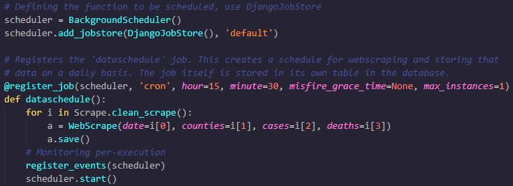
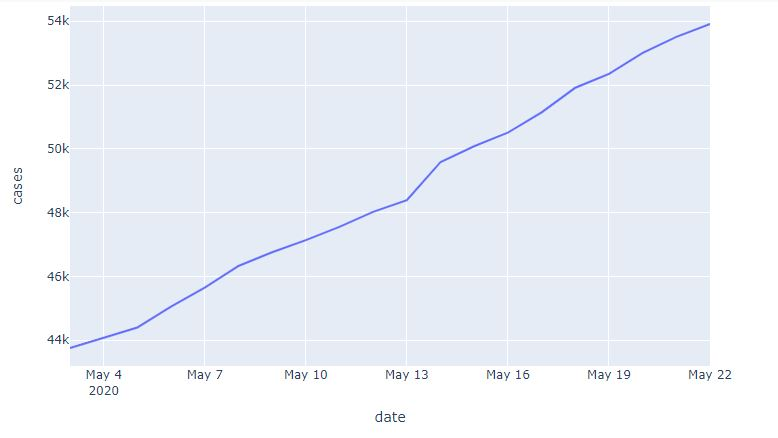

# tracker

A Django project. Scrapes data from a website, stores it in a database, and visualizes that data on a website (not deployed). Data is automatically updated daily. The goal of this project was to gain experience in Django, webscraping, and web development while documenting everything. Website and data used are the michigan.gov daily Coronavirus cases and deaths.


## Webscraping 
Using Beautifulsoup, created a class to be instantiated once a day. The scrapedata method parses HTML and uses regular expressions in isolating desired data. Date, county, cases, and deaths were the desired columns and a list is required with each. The cleanscrape method zips the above data into tuples as this presented an issue later when appending to the database. A final method called pandadata was made, though this is now unused. This method returns a Pandas dataframe object using the above data.

#### ** As of 06/05/20, the michigan.gov data is no longer displayed in the same way. It is now downloadable daily in a spreadsheet. Because of this, parsing the page html is no longer a viable method. Will need to automatically open these files and plug into a data frame. Everything else should remain more or less intact.

  
## Database 
Seen in the models.py file of the Scrape app, the database columns are made corresponding to the scraped data: Date, Counties, Cases, and Deaths. 


An AWS PostgreSQL instance was used for this project alongside pgAdmin (seen above) in testing and managing the database. Before automating this process, a manage.py Django command was created to save to the database manually: 

```python manage.py savetodb```

This is a custom command, also in the Scrape app, called savetodb.py. This command is now vestigial with the addition of task scheduling.


## Task Scheduling
The above processes were automated using APscheduler and django_apscheduler. With built-in models from apscheduler, scheduled jobs are registered in new tables in the database alongside a table that populates with job executions and errors. The job, dataschedule, essentially performs the same task as the savetodb.py command seen above. It instantiates the Scrape class, cleans the data, and stores it in a database table with Django's ORM. 




## Data Visualization
Visualizing the above data is done in a views.py function. This function creates a Pandas data frame:

```totals = df.loc[df['counties'] == 'Totals']```

The data is then broken up, analyzed, and placed in Plotly graphs. By using the to_html built-in Pandas method, creating a response out of the data frame is simple. When the url is requested, Django imports and calls the view containing the above function:




## Issues Faced
- A minor issue, but the scraped data had to have spaces removed between words (ex. St Clair -> StClair) due to a method further in the program having issues navigating empty space.
- A standing issue, accidentally causing circular dependencies. Poor practices implemented in importing dependencies (ex. from scrape.scrape import *).
- Poor practices with module naming, function naming. In some cases, this caused errors when importing dependencies.
- An issue with APscheduler where a setting had to be added to the __init__.py file in the root of the Scrape app. There were issues with pathing causing consistent errors.
- An issue intrinsic to how APscheduler tasks work. The data 'returned' in one of the jobs was needed elsewhere, however it wasn't accessible as it is a scheduled background task. This issue was solved by properly moving the needed functionality to a views.py function. Rather than displaying information per schedule, the information is requested with the homepage url and a response is given containing the desired graph(s) as HTML.
- The michigan.gov website began displaying their data differently. As expected, using Beautifulsoup to parse the HTML is no longer viable.


## Other/Future Considerations
- A major future consideration is to introduce error-handling. Currently, everything breaks if an exception is thrown.
- The webscraping portion of this project is very single-purpose. The Scrape class isn't particularly extensible beyond the scope of this project or to different applications.
- There are residual functions remaining in the project, such as the pandadata method within the Scrape class, that should be removed for clarity.
- The use of an AWS PostgreSQL database instance for this project was excessive, as there are only a few thousand rows of data being handled. The stock SQLite found in Django would have been acceptable.
- Potential future inclusion of an interactive front-end with user-inputs that query the database and visualize results (Django REST Framework?)
- Decided querying the database and extracting data for visualization as a scheduled task is not a good idea. Instead incorporating Django views/models and user inputs (dropdown selections) for visualization.

